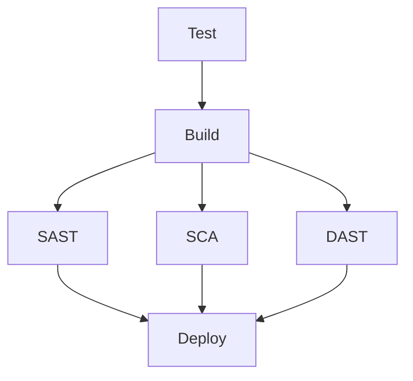

# Repo Template - DevOps CI/CD Workflows

Template de workflows reutilizables de GitHub Actions para implementar pipelines completos de CI/CD con integración a Azure Container Registry (ACR) y Kubernetes.

## 📋 Descripción

Este repositorio proporciona un conjunto de workflows modulares y reutilizables que implementan un pipeline completo de DevOps incluyendo:

- ✅ Testing automatizado
- 🏗️ Build y publicación de imágenes Docker
- 🔒 Análisis de seguridad (SAST, DAST, SCA)
- 🚀 Despliegue automatizado a Kubernetes

## 🎯 Características

- **Workflow Reutilizable**: Puede ser llamado desde otros repositorios
- **Pipeline Completo**: Test → Build → Security → Deploy
- **Seguridad Integrada**: 
  - SAST (Static Application Security Testing)
  - DAST (Dynamic Application Security Testing)
  - SCA (Software Composition Analysis)
- **Integración con Azure**: ACR y Kubernetes
- **Soporte OIDC**: Autenticación sin credenciales con Azure
- **Modular**: Cada etapa en su propio workflow

## 📁 Estructura de Workflows

```
.github/workflows/
├── template-ci.yml    # Workflow principal orquestador
├── test.yml           # Ejecución de pruebas
├── build.yml          # Build y push de imágenes Docker
├── sast.yml           # Análisis estático de código
├── sca.yml            # Análisis de dependencias
├── dast.yml           # Pruebas de seguridad dinámicas
└── deploy.yml         # Despliegue a Kubernetes
```

## 🚀 Uso

### Como Workflow Reutilizable

En tu repositorio, crea un workflow que llame a este template:

```yaml
name: CI/CD Pipeline

on:
  push:
    branches: [ main ]
  pull_request:
    branches: [ main ]

jobs:
  pipeline:
    uses: gperezusil/repo-template/.github/workflows/template-ci.yml@main
    with:
      image_name: mi-aplicacion
      acr_name: miregistro.azurecr.io
      deploy: true
      staging_url: https://staging.miapp.com
    secrets:
      ACR_USERNAME: ${{ secrets.ACR_USERNAME }}
      ACR_PASSWORD: ${{ secrets.ACR_PASSWORD }}
      KUBE_CONFIG_DATA: ${{ secrets.KUBE_CONFIG_DATA }}
```

### Parámetros de Entrada

#### Inputs

| Parámetro | Tipo | Requerido | Default | Descripción |
|-----------|------|-----------|---------|-------------|
| `image_name` | string | ✅ | - | Nombre de la imagen Docker |
| `acr_name` | string | ✅ | - | URL del Azure Container Registry |
| `deploy` | boolean | ❌ | true | Si se debe ejecutar el despliegue |
| `staging_url` | string | ❌ | - | URL del ambiente de staging para DAST |

#### Secrets

| Secret | Requerido | Descripción |
|--------|-----------|-------------|
| `ACR_USERNAME` | ✅ | Usuario del Azure Container Registry |
| `ACR_PASSWORD` | ✅ | Contraseña del Azure Container Registry |
| `AZURE_CLIENT_ID` | ✅ | Client ID de Azure (si usas OIDC) |
| `AZURE_TENANT_ID` | ✅ | Tenant ID de Azure (si usas OIDC) |
| `AZURE_SUBSCRIPTION_ID` | ✅ | Subscription ID de Azure (si usas OIDC) |


## 🔄 Pipeline de Ejecución

El workflow principal (`template-ci.yml`) ejecuta las siguientes etapas en orden:



1. **Test**: Ejecuta las pruebas unitarias y de integración
2. **Build**: Construye la imagen Docker y la publica en ACR
3. **Análisis de Seguridad (en paralelo)**:
   - **SAST**: Análisis estático del código fuente
   - **SCA**: Análisis de vulnerabilidades en dependencias
   - **DAST**: Pruebas de seguridad dinámicas
4. **Deploy**: Despliega la aplicación en Kubernetes **solo si todas las pruebas de seguridad pasan**

### 🔒 Gate de Seguridad

El despliegue está protegido por un gate de seguridad: **todas las pruebas (SAST, SCA y DAST) deben pasar exitosamente antes de desplegar**. Si cualquier prueba de seguridad falla, el pipeline se detiene y no se realiza el despliegue.

## ⚙️ Configuración en tu Repositorio

### 1. Configurar Secrets

Ve a `Settings` → `Secrets and variables` → `Actions` y agrega:

**Para autenticación con credenciales:**
```
ACR_USERNAME=tu-usuario-acr
ACR_PASSWORD=tu-password-acr
KUBE_CONFIG_DATA=tu-kubeconfig-base64
```

**Para autenticación con OIDC:**
```
ACR_USERNAME=tu-usuario-acr
ACR_PASSWORD=tu-password-acr
AZURE_CLIENT_ID=tu-client-id
AZURE_TENANT_ID=tu-tenant-id
AZURE_SUBSCRIPTION_ID=tu-subscription-id
```

### 2. Crear el Workflow

Crea `.github/workflows/main.yml` en tu repositorio con el ejemplo de uso mostrado arriba.

### 3. Personalizar Parámetros

Ajusta los parámetros según tus necesidades:
- `image_name`: Nombre de tu aplicación
- `acr_name`: Tu registro de Azure
- `deploy`: false si solo quieres CI sin CD
- `azure_oidc`: true para usar OIDC (más seguro)

## 🔒 Seguridad

### SAST (Static Application Security Testing)
Analiza el código fuente en busca de vulnerabilidades conocidas y malas prácticas de seguridad.

### SCA (Software Composition Analysis)
Escanea las dependencias y librerías de terceros en busca de vulnerabilidades conocidas (CVEs).

### DAST (Dynamic Application Security Testing)
Realiza pruebas de penetración automatizadas contra la aplicación desplegada.

## 🛠️ Requisitos

- Repositorio de GitHub
- Azure Container Registry
- Cluster de Kubernetes (AKS u otro)
- Dockerfile en la raíz del proyecto
- Tests configurados (para el workflow de test)

## 📖 Workflows Individuales

### test.yml
Ejecuta las pruebas de la aplicación. Debe ser personalizado según el lenguaje y framework utilizado.

### build.yml
- Construye la imagen Docker
- Etiqueta con el SHA del commit
- Publica en Azure Container Registry

### sast.yml
Ejecuta análisis estático de seguridad del código.

### sca.yml
Analiza las dependencias y detecta vulnerabilidades conocidas.

### dast.yml
Realiza pruebas de seguridad dinámicas contra la aplicación.

### deploy.yml
- Despliega a Kubernetes **solo si todas las pruebas de seguridad pasan**
- Configura 2 réplicas por defecto
- Puerto 8000 por defecto
- Soporta autenticación OIDC o kubeconfig
- Depende de: SAST, SCA y DAST

## 📝 Ejemplo Completo

```yaml
name: Production Pipeline

on:
  push:
    branches: [ main ]

jobs:
  deploy-production:
    uses: gperezusil/repo-template/.github/workflows/template-ci.yml@main
    with:
      image_name: myapp
      acr_name: myregistry.azurecr.io
      deploy: true
      azure_oidc: true
      staging_url: https://staging.myapp.com
    secrets:
      ACR_USERNAME: ${{ secrets.ACR_USERNAME }}
      ACR_PASSWORD: ${{ secrets.ACR_PASSWORD }}
      AZURE_CLIENT_ID: ${{ secrets.AZURE_CLIENT_ID }}
      AZURE_TENANT_ID: ${{ secrets.AZURE_TENANT_ID }}
      AZURE_SUBSCRIPTION_ID: ${{ secrets.AZURE_SUBSCRIPTION_ID }}
```

## 👤 Autor

**Gherson Perez** (gperezusil)

- GitHub: [@gperezusil](https://github.com/gperezusil)

---
